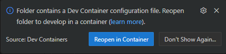

# Depsight Third-Party Plugin

## Usage

### Installation

#### Download the Python Wheels

- Download the latest `depsight` `.whl` from the [depsight-dependency-manager releases](https://github.com/ValentinTwin1206/depsight-dependency-manager/releases/latest) page.
- Download the latest plugin `.whl` from this repository's [GitHub Releases](../../releases/latest) page.

#### With uv

```bash
uv add <path/to/depsight-*.whl> <path/to/depsight_third_party_plugin-*.whl>
```

#### With pip

```bash
pip install <path/to/depsight-*.whl> <path/to/depsight_third_party_plugin-*.whl>
```

### Getting Started

Coming soon...

## Development

### System Requirements

- **IDE with DevContainer support** — either of the following:
    - [Visual Studio Code](https://code.visualstudio.com/) with the [Dev Containers](https://marketplace.visualstudio.com/items?itemName=ms-vscode-remote.remote-containers) extension
    - [JetBrains Gateway](https://www.jetbrains.com/remote-development/gateway/) (supports Dev Containers via the Remote Development plugin)
- **Container manager** — any one of the following:
    - [Docker Desktop](https://www.docker.com/products/docker-desktop/) (macOS, Windows, Linux) (**RECOMMENDED**)
    - [Docker Engine](https://docs.docker.com/engine/install/) (Linux)
    - [Podman](https://podman.io/) with the Podman Desktop or CLI

### Setup Locally

- Open Visual Studio Code at the project root directory
- When prompted, click **Reopen in Container** (or use Command Palette: `Dev Containers: Reopen in Container`)

  

- Wait for the containers to build and start
- Once ready, you'll have a fully configured development environment with all dependencies installed
- Open a terminal inside the DevContainer and run `depsight --help`

### Run Tests

- Open a terminal inside the DevContainer
- Activate the virtual environment:

  ```bash
  source .venv/bin/activate
  ```

- Run all tests:

  ```bash
  pytest tests/ -v
  ```

### Build And Run Container

#### Build

- Open a terminal inside the DevContainer and run following command:

```bash
docker build \
  --build-arg UV_VERSION=0.10.9 \
  --build-arg DEPSIGHT_VERSION=0.1.0 \
  -t depsight-plugin:latest \
  .
```

#### Run

- Open a terminal inside the DevContainer and run following command:

```bash
docker run --rm -it \
  -v "$PWD":/project \
  depsight-plugin:latest myplugin scan --project-dir /project
```

- `-v "$PWD":/project` — mounts your current directory into `/project` inside the container
- `--project-dir /project` — tells depsight to scan the mounted directory
- Any arguments after the image name are forwarded to the `depsight` entrypoint


## Release

#### Pre-release (via Workflow Dispatch)

- Navigate to your repository on GitHub and click the **Actions** tab
- Select the **Manual Dispatch** workflow from the left sidebar
- Click **Run workflow**
- Set `plugin_version` to the version string to verify against `pyproject.toml` (e.g. `1.2.3`) — this field is **required**
- Optionally set `uv_version` (defaults to `0.10.9`), `depsight_version` (defaults to `1.0.0`), or check **Push the container image to Docker Hub**
- Click **Run workflow**

#### Release (via GitHub Release)

- Bump the `version` field in `pyproject.toml` to the desired version (e.g. `1.2.3`)
- Commit and push the change to `main`
- Navigate to your repository on GitHub and click **Releases** → **Draft a new release**
- Create a new tag matching the version in `pyproject.toml` exactly (e.g. `1.2.3`)
- Click **Publish release**
- The **Release** workflow triggers automatically, runs the full CI pipeline, and pushes the Docker image to Docker Hub
